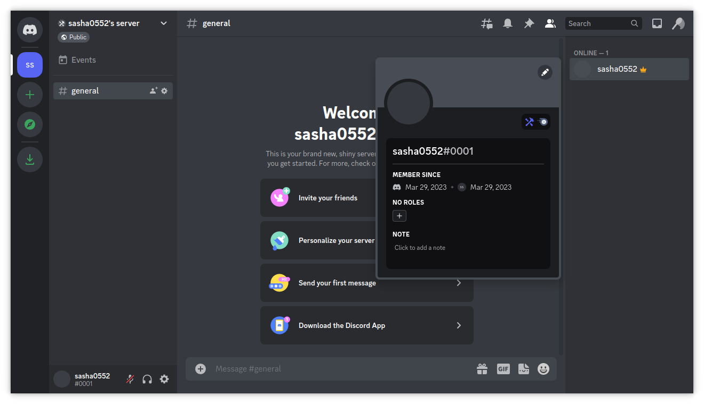
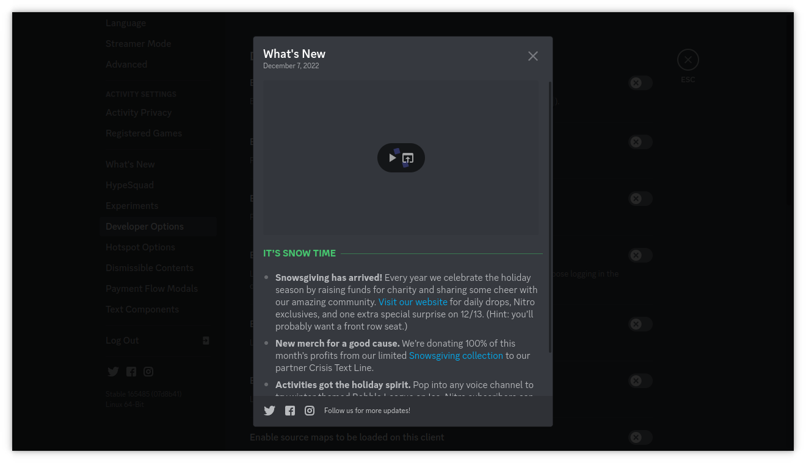

https://sasha0552.github.io/unofficial-discord-api-docs/

# Introduction

This is an *unofficial* Discord API documentation created by reverse engineering the official Discord client build.

Current reverse engineered version of the official client is `2023-01-01 (Stable 165485)`.

My goal is to build a fully Discord-compatible backend server (because I'm not a frontend developer) with possibility to use it as own self-hosted messenger.  

# Contributing to the Project

If you want to help me in the reverse engineering process, I can give you an entire client build (I wrote some tools for downloading the Discord client from discord.com website, so the client can be used completely offline), and access to a test backend endpoint.  

Also, if you have any questions about Discord client or backend, you're free to contact me. I'll try my best to answer you.  

## Contacts

Discord: `sasha0552#5178`.  
I've created a [guild](https://discord.gg/SX8dvXuTfR) for this.  

